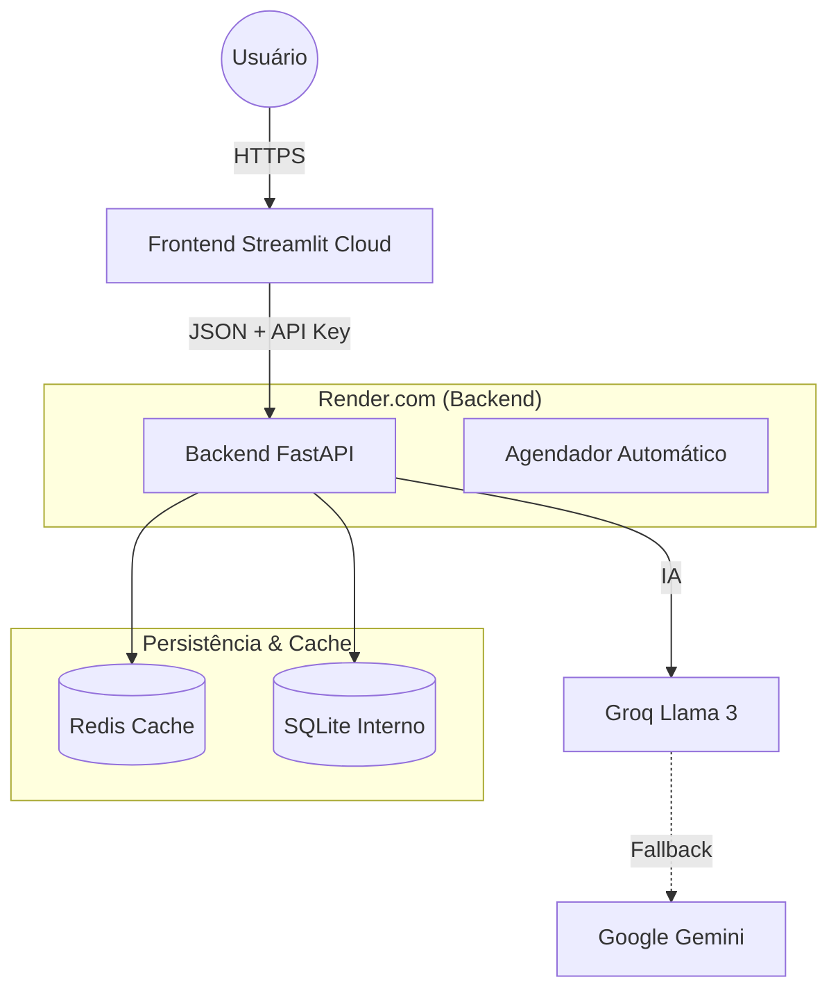

# AgenteNoticiasSegPub - Intelligence News Hub

> **Sistema de Inteligência Artificial para Monitoramento e Análise de Informações sobre Segurança Pública.**
> 
> *Transformando dados brutos em informações relevantes sobre o Distrito Federal.*


---

## Sobre o Projeto

O **AgenteNoticiasSegPub** é uma solução desenvolvida para monitorar, coletar e analisar notícias de segurança pública em tempo real. O sistema utiliza múltiplos agentes de busca e Inteligência Artificial Generativa para filtrar e resumir incidentes críticos, oferecendo uma visão clara do cenário de segurança no DF.

Este projeto foi desenvolvido no âmbito do MBA em Inteligência Artificial Generativa do IBMEC/PCDF e foi construído visando implementar um fluxo de trabalho profissional de Engenharia de Software e Engenharia de Inteligência Artificial. Diferente de protótipos baseados em notebooks, esta é uma aplicação **microsserviço**, conteinerizada e pronta para implantação em nuvem.

---

## Arquitetura Híbrida em Nuvem

O sistema opera em uma arquitetura de microsserviços distribuída, otimizada para tirar proveito dos planos gratuitos de grandes provedores de nuvem (Render e Streamlit Cloud).



### Componentes Principais

1.  **Frontend (Streamlit Cloud)**: Hospeda a interface do usuário. Leve, rápido e se conecta ao backend via API.
2.  **Backend (Render.com)**: O "cérebro" do sistema. Hospeda a API FastAPI, o banco de dados SQLite e o Scheduler. 
    *   *Nota: O Render mantém o serviço ativo para processar as requisições do frontend.*
3.  **Segurança**: A comunicação entre Front e Back é protegida por `X-API-Key`.

---

## Guia de Implantação e Execução

Este projeto pode ser rodado de duas formas: **Localmente** (para desenvolvimento) ou **Na Nuvem** (para produção real).

### 1. Desenvolvimento Local (Sua Máquina)

Use este método para testar mudanças no código antes de enviar para o GitHub.

1.  **Instale as dependências**:
    ```bash
    pip install -r requirements.txt
    ```

2.  **Inicie o Backend (Servidor)**:
    ```bash
    # Terminal 1
    python -m uvicorn backend.main:app --reload --port 8001
    ```

3.  **Inicie o Frontend (Interface)**:
    ```bash
    # Terminal 2
    streamlit run app.py
    ```
    *O App abrirá automaticamente no seu navegador (http://localhost:8501).*

---

### 2. Implantação em Nuvem (Produção)

Para colocar o sistema no ar "de verdade", usamos uma estratégia dividida:

#### Passo A: Backend (Render.com)
O Backend processa os dados e a inteligência artificial.
1.  Crie uma conta no [Render](https://render.com/).
2.  Clique em **New > Blueprint**.
3.  Conecte seu repositório GitHub (`AgenteNoticiasSegPub`).
4.  O Render detectará automaticamente o arquivo `render.yaml`.
5.  Preencha as variáveis de ambiente solicitadas:
    *   `GROQ_API_KEY`: Sua chave da Groq.
    *   `GOOGLE_API_KEY`: Sua chave do Google AI.
    *   `APP_API_KEY`: Crie uma senha forte (ex: `Segredo123`). **Anote-a!**
6.  Clique em **Apply**. O deploy levará ~3 minutos.
7.  **Copie a URL do serviço** gerado (ex: `https://agente-segpub-api-xyz.onrender.com`).

#### Passo B: Frontend (Streamlit Cloud)
O Frontend é o visual que você acessa.
1.  Acesse o [Streamlit Cloud](https://streamlit.io/cloud).
2.  Crie um novo App conectado ao mesmo repositório GitHub.
3.  Vá em **Settings > Secrets** e configure a conexão com o Backend:

```toml
# URL que você copiou do Render (SEM BARRA NO FINAL)
API_URL = "https://agente-segpub-api-xyz.onrender.com"

# A senha que você criou no passo anterior
APP_API_KEY = "Segredo123"

# Configurações de Login (Copie do seu auth_config.yaml local)
[credentials]
usernames.admin.password = "..."
...
```

4.  Reinicie o App, ele estará conectado ao seu Backend na nuvem

---


## Controle de Acesso e Usuários

Para garantir a segurança do painel administrativo, implementamos um sistema de autenticação robusto.

### Arquitetura de Autenticação (Opção 1 - Ágil)
Optamos pela arquitetura **Streamlit Authenticator** (baseada em cookies cifrados e configuração local) em detrimento de uma solução complexa baseada em JWT/Banco de Dados. 

**Justificativa:**
- **Agilidade**: Permitiu implementação imediata sem necessidade de migração de banco de dados.
- **Suficiência**: Adequada para o cenário atual de uso interno por equipe restrita.
- **Segurança**: As senhas são armazenadas apenas como **Hashes** seguras (bcrypt), nunca em texto plano.

### Aviso de Segurança
**NUNCA** commite o arquivo `auth_config.yaml` com senhas reais. Ele deve ser configurado apenas no ambiente de produção.

### Como Gerenciar Usuários
1.  Utilize o script utilitário para gerar hashes de senha seguras:
    ```bash
    python generate_keys.py
    ```
2.  Copie as hashes geradas para o arquivo `auth_config.yaml`.
3.  Reinicie a aplicação para aplicar as alterações.


## Desafios Solucionados

A jornada de transformação deste projeto de um notebook acadêmico para um produto de engenharia de software envolveu diversos desafios técnicos:

### 1. Do "Colab" para Microsserviços
> **Desafio**: O código original era monolítico e difícil de escalar ou manter.
>
> **Solução**: Desacoplamento total em arquitetura Cliente-Servidor. O Frontend (Streamlit) agora é "burro" e consome uma API (FastAPI) inteligente e centralizada.

### 2. Latência e Limites de API
> **Desafio**: Consultas repetitivas a LLMs e APIs de busca são lentas e custosas.
>
> **Solução**: Implementação de **Redis Cache** com TTL (Time-to-Live). Consultas frequentes são respondidas em milissegundos sem tocar nas APIs externas.

### 3. "Dormir Tranquilo" (Automação)
> **Desafio**: A coleta manual de notícias é insustentável.
>
> **Solução**: Integração do **APScheduler** no backend. O sistema trabalha sozinho em horários pré-determinados, popular o banco de dados enquanto você dorme.

### 4. Segurança em Produção
> **Desafio**: APIs expostas sem proteção.
>
> **Solução**: Implementação de Middleware de Autenticação. Nenhuma requisição passa sem uma `API Key` válida, garantindo integridade e controle de acesso.

---



## Estrutura do Projeto

Abaixo, um esquema dos principais diretórios e arquivos do projeto:

```
AgenteNoticiasSegPub/
├── app.py                # Frontend (Streamlit) - Interface do usuário e lógica de exibição.
├── auth_config.yaml      # Configurações de Autenticação (Usuários e Cookies). IGNORADO no Git.
├── .env                  # Variáveis de Ambiente (API Keys). IGNORADO no Git.
├── docker-compose.yml    # Orquestração de Containers (Frontend, Backend, Redis).
├── requirements.txt      # Dependências Python do projeto.
├── prompt.txt            # Playbook de construção (Engenharia de Prompt).
│
├── backend/              # Lógica do Servidor (API FastAPI)
│   ├── main.py           # Ponto de entrada da API, rotas /news, /chat e agendador.
│   ├── agent.py          # Lógica de Inteligência Artificial (Groq/Gemini).
│   ├── fetchers.py       # Coletores de Notícias (Google RSS, NewsAPI, DuckDuckGo).
│   ├── database.py       # Conexão com Banco de Dados (SQLite/Async).
│   ├── models.py         # Modelos de Dados (Pydantic/SQLAlchemy).
│   ├── logging_config.py # Configuração de Logs Estruturados.
│   └── utils.py          # Funções utilitárias (Data, validações).
│
├── data/                 # Armazenamento Persistente
│   └── noticias.db       # Banco de Dados SQLite (Notícias e Logs).
│
├── tests/                # Testes Automatizados
│   ├── test_api.py       # Testes de Integração da API (Endpoints e Auth).
│   ├── test_scheduler.py # Testes do Agendador (Verificação de Jobs).
│   ├── test_core_logic.py# Testes Unitários (Banco de Dados e Parsers).
│   └── test_agent_mock.py# Testes de Resiliência (Fallback de IA).
│
└── .github/              # Automação (DevOps)
    └── workflows/
        ├── ci.yml            # Pipeline de Linting (Ruff).
        └── schedule_test.yml # Pipeline Completo de Testes (Pytest).
```

## Estratégia de Testes e Qualidade

Para garantir a estabilidade de uma aplicação crítica de segurança pública, implementamos uma pirâmide de testes robusta executada automaticamente via **GitHub Actions**:

1.  **Testes de Integração de API** (`test_api.py`):
    *   Verificam se os endpoints estão respondendo corretamente.
    *   Garantem que a autenticação (`X-API-Key`) está bloqueando acessos indevidos.

2.  **Testes de Agendamento** (`test_scheduler.py`):
    *   Validam se o robô de coleta está programado para rodar nos horários críticos (11:00 e 23:00).
    *   Testam o gatilho manual de emergência (`/force-fetch`).

3.  **Testes de Lógica Core** (`test_core_logic.py`):
    *   **Banco de Dados**: Garante que notícias são salvas e recuperadas sem duplicidade, usando um banco em memória isolado.
    *   **Parsers**: Testa a extração de dados de fontes externas (Google RSS, GDELT) simulando respostas variantes para evitar quebras por mudança de layout.

4.  **Testes de Resiliência de IA** (`test_agent_mock.py`):
    *   Simula falhas na API principal (Groq/Llama 3) para garantir que o sistema ativa automaticamente o **Fallback** para o Google Gemini, mantendo o serviço operacional mesmo em crises.

## Reconstrução do Projeto (Prompt Engineering)

Este projeto inclui um **"Playbook de Reconstrução"** no arquivo `prompt.txt`.

Trata-se de um manual de engenharia de prompt que permite recriar toda a arquitetura do sistema do zero utilizando LLMs (ChatGPT, Claude, Gemini). O arquivo contém:

*   **System Prompts Avançados**: Para configurar a "Persona" do desenvolvedor sênior.
*   **Sequência Lógica**: Prompts passo-a-passo (4Cs e O-R-A) cobrindo Infraestrutura, Backend, Lógica de IA, Frontend e QA.
*   **Melhores Práticas**: Instruções que garantem código seguro, validado e documentado.

Caso deseje escalar ou refatorar o projeto, utilize o `prompt.txt` como guia mestre.

---

# Guia Didático de Engenharia de Prompt (`prompt2.txt`)

## Engenharia de Prompt e Contexto

### Anatomia de Prompts Eficazes

#### Padrões de Efetividade Comprovados

**1. Regra dos 4 Cs:**
*   **Claro**: Instruções sem ambiguidade.
*   **Conciso**: Elimina redundância, mantém o essencial.
*   **Completo**: Inclui todos os requisitos.
*   **Consistente**: Padrão previsível nas respostas.

**2. Estrutura O-R-A:**
*   **Objetivo**: O que deve ser alcançado.
*   **Regras**: Limitações e condições.
*   **Ação**: Processo específico a seguir.

**3. Hierarquia de Prioridades:**
*   1º Segurança/Ética (Não negociável).
*   2º Formato/Especificação (Crítico para integração).
*   3º Domínio/Expertise (Qualidade da resposta).
*   4º Estilo/Comunicação (Experiência do usuário).

### Estrutura de Mensagens: System, User e Assistant

Sistemas de LLM modernos utilizam um sistema de papéis hierárquico:

#### 1. System Message (Mensagem do Sistema)
*Propósito*: Configurar o contexto permanente e as regras de comportamento.
*Características*: Primeira mensagem, invisível ao usuário final, define a "Persona".

*Exemplo de Prompt*:
```json
{
  "role": "system",
  "content": "Você é o núcleo de inteligência do AgenteNoticiasSegPub. Sua função é analisar dados de segurança pública do Distrito Federal. REGRAS: 1. Foco exclusivo em PMDF, PCDF, CBMDF. 2. Formate a saída sempre em JSON."
}
```

#### 2. User Message (Mensagem do Usuário)
*Propósito*: A entrada do usuário ou os dados brutos a serem processados.

*Exemplo*:
```json
{
  "role": "user", 
  "content": "Resultados da busca web: [DADOS BRUTOS]. Gere o relatório de inteligência."
}
```

#### 3. Assistant Message (Mensagem do Assistente)
*Propósito*: Histórico de respostas ou exemplos (Few-Shot Learning).

*Exemplo (Few-Shot)*:
```json
[
    {"role": "user", "content": "Notícia: 'PMDF apreende drogas...'"},
    {"role": "assistant", "content": "{\"status\": \"sucesso\", ...}"}
]
```

### Papel do System Prompt na Definição de Comportamento

#### Componentes Estratégicos

**A. Definição de Identidade (Persona)**
Alinha o modelo com o domínio específico.
```python
"""
Você é 'AgenteSegPub-Core', especialista em monitoramento de incidentes e análise criminal no DF.
"""
```

**B. Regras de Comportamento (Constraints)**
Reduz alucinações.
```python
"""
REGRAS ABSOLUTAS:
1. NUNCA invente fatos.
2. SEMPRE cite a fonte original.
3. Ignore notícias de fora do DF.
"""
```

**C. Instruções de Processamento (Process)**
Garante consistência.
```python
"""
PROCESSO:
1. Filtragem (É segurança do DF?)
2. Extração (Quem, Quando, Onde?)
3. Estruturação (JSON para DB)
"""
```

**D. Configuração de Tom (Tone)**
Adapta a comunicação.
```python
"""
TOM: Jornalístico, Técnico e Imparcial (Estilo Briefing).
"""
```

### Formatação de Saída: Técnicas Avançadas

#### H. JSON (Integração de Sistemas)
Ideal para comunicação Backend <-> IA.
```python
"""
FORMATO DE RESPOSTA (JSON):
{
    "incidentes": [{ "titulo": "string", "local": "string" }],
    "risco": "alto|medio|baixo"
}
"""
```

#### J. Markdown (Visualização Humana)
Ideal para relatórios no Frontend (Streamlit).
```python
"""
Analise os dados e responda em Markdown:
# Relatório Semanal
## Panorama Geral
...
"""
```

---

# Blueprint de Construção do Projeto (`prompt.txt`)

## 1. Conceito e Estratégia
Este documento contém a sequência de prompts para reconstruir o projeto "Agente de Notícias de Segurança Pública" do zero.

### DNA do Projeto
*   **Arquitetura**: Microsserviços (Frontend Streamlit + Backend FastAPI + Redis + Worker).
*   **Stack**: Python 3.10, Docker Compose, SQLite.
*   **Diferencial**: Resiliência e Testabilidade.

## 2. System Prompt Mestre (A Persona)
*Prompt inicial para definir o Arquiteto de Software.*

```json
{
  "role": "system",
  "content": "Você é um Arquiteto de Software Sênior especializado em Python e Microsserviços. SUA MISSÃO: Liderar o desenvolvimento do 'AgenteNoticiasSegPub'. DIRETRIZES: Stack FastAPI/Streamlit/Redis, Segurança via API Key, Código resiliente."
}
```

## 3. Fase 1: Infraestrutura e Ambiente
*Objetivo: Base Docker e Estrutura de Pastas.*

### Prompt 1.1: Estrutura e Docker
**Objetivo**: Configurar Docker Compose orquestrando Frontend, Backend e Redis.
**Ação**: Gerar `docker-compose.yml`, `Dockerfile` e `requirements.txt`.

## 4. Fase 2: Backend Core e Dados
*Objetivo: API, Banco de Dados e Logs.*

### Prompt 2.1: Modelos e Banco de Dados
**Objetivo**: Criar `backend/models.py` (Pydantic) e `backend/database.py` (SQLite).
**Regras**: Usar `sqlite3` nativo e implementar logs.

### Prompt 2.2: API Main e Segurança
**Objetivo**: Criar `backend/main.py`.
**Funcionalidades**: Middleware de Auth (`X-API-Key`), Endpoints `/news` (com Cache Redis) e `/chat`.

## 5. Fase 3: Lógica de Negócio (ETL & AI)
*Objetivo: Coletores e Agente Inteligente.*

### Prompt 3.1: Fetchers (Coletores)
**Objetivo**: Criar `backend/fetchers.py`.
**Métodos**: Google RSS, GDELT, DuckDuckGo. Implementar `fetch_all` com deduplicação.

### Prompt 3.2: Agendador (Scheduler)
**Objetivo**: Atualizar `backend/main.py` com `APScheduler`.
**Ação**: Jobs às 11:00 e 23:00. Endpoint `/force-fetch`.

### Prompt 3.3: Agente de IA com Fallback
**Objetivo**: Criar `backend/agent.py`.
**Lógica**: Tentar Groq (Llama 3). Se falhar, ativar Fallback para Google Gemini.

## 6. Fase 4: Frontend
*Objetivo: Interface Visual.*

### Prompt 4.1: Aplicação Streamlit
**Objetivo**: Criar `app.py`.
**Layout**: Sidebar (Configs), Tab Monitoramento (Cards de Notícias), Tab Chat (Interação com IA).

## 7. Fase 5: Qualidade e Testes
*Objetivo: Garantir estabilidade.*

### Prompt 5.1: Testes Automatizados
**Objetivo**: Criar suite `tests/`.
**Escopo**: `test_api.py` (Integração), `test_core_logic.py` (Unitários DB/Parser), `test_scheduler.py` (Jobs).

### Prompt 5.2: CI/CD Pipeline
**Objetivo**: Criar `.github/workflows/schedule_test.yml`.
**Configuração**: Rodar `pytest` a cada push na main.
